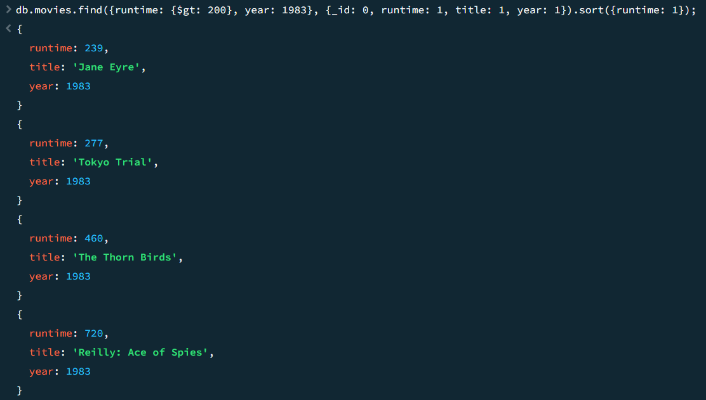
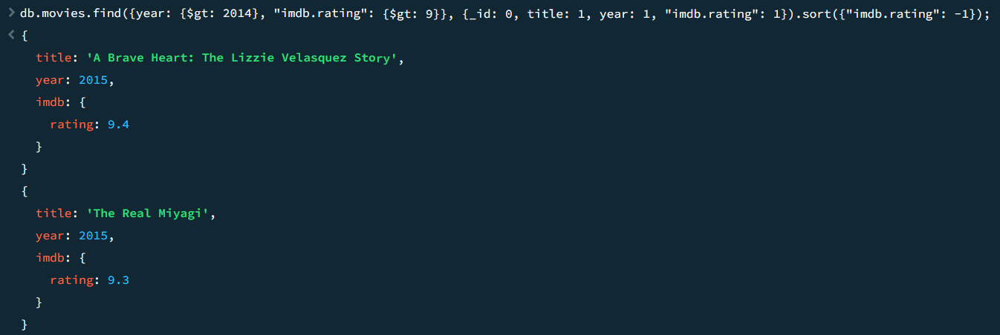

# Assignment 3

## Question 1
Find all movies with runtime greater than 200 minutes in year 1983. 
The result should include a list of objects sorted by runtime increasing, and each object only has three fields: runtime, title, year.

## Question 2
Find all movies after year 2014 with imdb rating greater than 9. 

